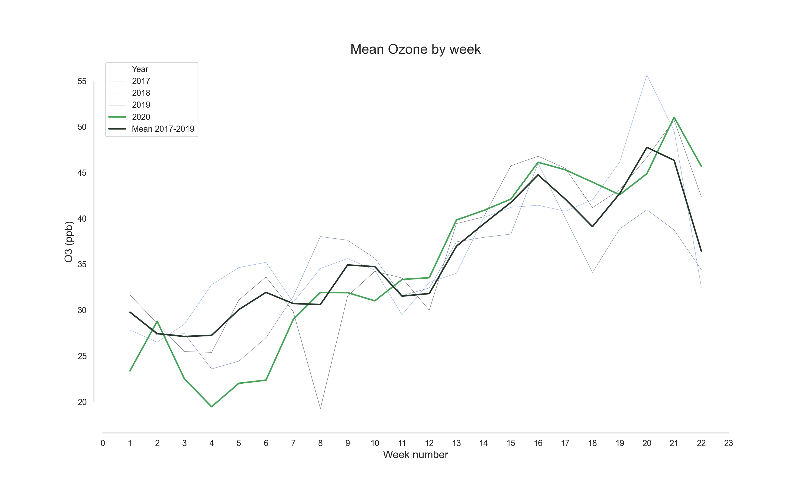
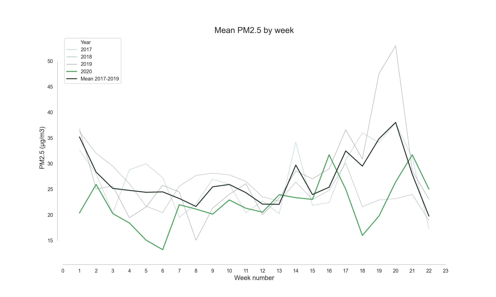
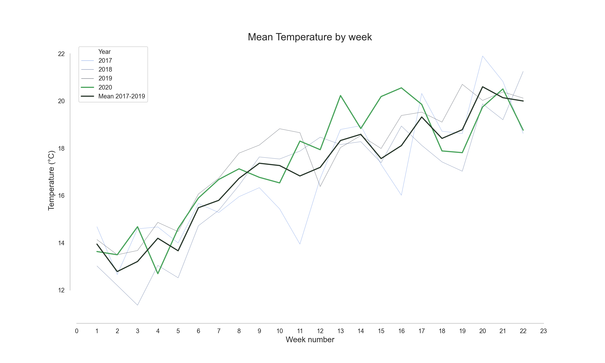

# COVID-19 lockdown and its effect on pollution levels in Mexico City
## Developed by [ITDP Mexico](http://mexico.itdp.org)
**Status:** beta

This repository contains a brief analysis of the effect of the COVID-19 lockdown in the pollution levels of the Metropolitan Area of Mexico City. The data was obtained from the Mexico City Secretary of the Environment [portal (Secretaría del Medio Ambiente)](http://www.aire.cdmx.gob.mx/default.php).

This short analysis compares the pollution levels of the following pollutants:
- PM10
- PM2.5
- NO2
- Ozone

Of the last 3 years (2017-2019) with the levels in 2020. 

##  Results

|  	| Week 23 (june 1 - june 7) 	|  	|  	|
|-	|-	|-	|-	|
| Pollutant 	| Average 2017-2019 	| 2020                                                                                                                                                                                                                                                                                                	| Decrease  	|
| PM10 	|        35.9                        	|        16.9     	| 53.05% 	|
| PM2.5 	|        19.2        	| 14.0          	| 27.24% 	|
| NO2 	|        20.5         	|        13.0  	| 36.36% 	|
| O3 	|        37.5                          	|        22.7           	| 39.57% 	|

## Contributing Members

[ITDP Mexico team](http://mexico.itdp.org)
Team Leads (Contacts) :
- Daniel Bustillos : Data Scientist
  - [juan.bustillos@itdp.org](juan.bustillos@itdp.org)*
- Lizeth H.:
Air Quality and Transport Analyst
  - pending

*Correspondence
